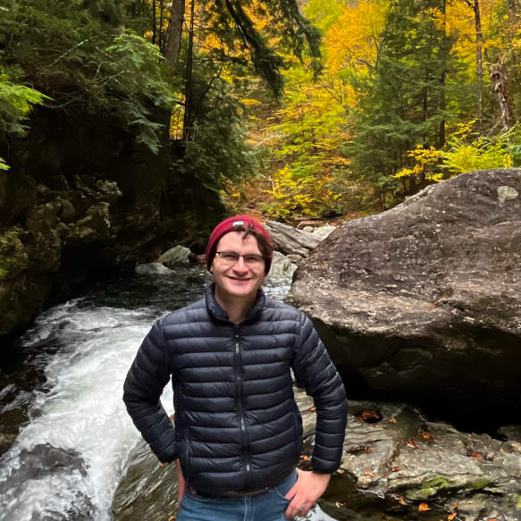

I'm Ryan Wallace, a member of the [AppSRE Team @ Red Hat](https://github.com/app-sre/), working closely with [Quay.io](https://github.com/quay/). 
Day to day, I work on running reliable services for my team and other Red Hatters built on key open-source technologies like Kubernetes, Prometheus, and GraphQL.

Outside of work I like to spend my time bicycling, working on home automation projects,
and advocating for livable streets and human rights for all in my local community.

Check out my [website](https://ryanwallace.cloud/map/).

### Stats

